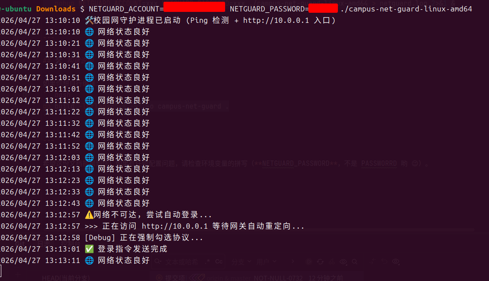

# Campus Net Guard (校园网自动连守护进程)

🚀 一个基于 Go + Chromedp 开发的校园网自动登录工具，支持全平台运行。它能持续监控网络状态，在检测到断网时自动模拟浏览器执行登录操作。

## 📋 功能特性
* **无头运行**：使用 Chromium 核心，模拟真实用户操作，绕过简单的接口校验。
* **双模式配置**：支持环境变量和配置文件（YAML/JSON/TOML）。
* **跨平台**：提供 Windows, Linux, macOS (AMD64/ARM64) 预编译二进制文件。
* **自愈能力**：定时 Ping 检测，自动重连。



---

## ⚙️ 参数配置

本项目使用 **Viper** 管理配置。优先级顺序为：**环境变量 > 配置文件 > 默认值**。

### 1. 核心参数说明
| 参数名 | 环境变量名 | 默认值 | 说明 |
| :--- | :--- | :--- | :--- |
| `account` | `NETGUARD_ACCOUNT` | (必填) | 校园网账号 |
| `password` | `NETGUARD_PASSWORD` | (必填) | 校园网密码 |
| `login_url` | `NETGUARD_LOGIN_URL` | `http://10.0.0.1` | 登录网关地址 |
| `check_period`| `NETGUARD_CHECK_PERIOD`| `10s` | 断网检测频率 |
| `ping_target` | `NETGUARD_PING_TARGET` | `1.1.1.1` | 用于判断联网状态的地址 |

---

## 🚀 快速开始

### 方式 A：使用环境变量（推荐，适合 Linux/macOS）

直接在终端启动程序，无需创建额外文件。

**Linux / macOS:**
```bash
# 注意：环境变量名必须大写，且以 NETGUARD_ 开头
NETGUARD_ACCOUNT=你的账号 NETGUARD_PASSWORD=你的密码 ./campus-net-guard-linux-amd64
```

**Windows (PowerShell):**
```powershell
$env:NETGUARD_ACCOUNT="你的账号"; $env:NETGUARD_PASSWORD="你的密码"; .\campus-net-guard-windows-amd64.exe
```

---

### 方式 B：使用配置文件（适合长期运行）

在程序同级目录下创建 `config.yaml`（也可以是 `.json` 或 `.toml`）。

1. **创建 `config.yaml`**:
   ```yaml
   account: "20241001"
   password: "your_password"
   login_url: "http://10.0.0.1"
   check_period: "30s"
   ```

2. **直接运行**:
   ```bash
   ./campus-net-guard-linux-amd64
   ```

---

## ⚠️ 注意事项

1. **环境依赖**：
   由于程序使用了 `chromedp`，运行环境中必须安装有 **Google Chrome** 或 **Chromium** 浏览器。
    * **Ubuntu 安装命令**: `sudo apt update && sudo apt install -y chromium-browser`

2. **权限要求**：
   在 Linux 下如果无法 Ping 通，可能需要 sudo 权限或者授予程序网络权限：
   ```bash
   sudo setcap cap_net_raw+ep ./campus-net-guard-linux-amd64
   ```

3. **后台运行 (Linux)**：
   建议配合 `nohup` 或 `systemd` 使用：
   ```bash
   nohup NETGUARD_ACCOUNT=xxx NETGUARD_PASSWORD=xxx ./campus-net-guard-linux-amd64 > netguard.log 2>&1 &
   ```

---

## 🛠️ 构建说明

如果你想自行编译：
```bash
go build -ldflags="-s -w" -o campus-net-guard .
```
